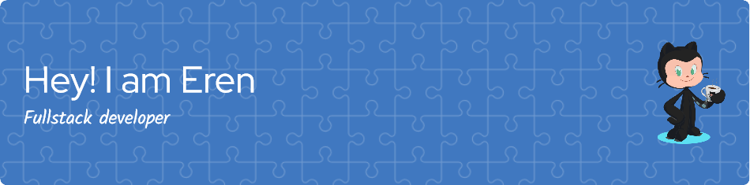

Welcome to My GitHub Profile! 🚀

### 😄 About Me 💻

Hi there! I'm Eren, a passionate software developer with a love for all things coding. I have experience in various programming languages, including C#, javaScript, and python. My goal is to contribute to open-source projects and collaborate with other developers to create amazing software solutions. 

### 🛠️ Stack

 
 
 
  
 
 
 
 
 
 
 
 
 
 
 
 
 
 
 
 
 
 
 
 
 
 
 
 
 
 
 
 
 
 
 
 
 

 
---

### :bar_chart: Stats

## Contact Me 📞

 
  

Feel free to explore these projects and provide feedback or suggestions. I'm always open to learning and improving my skills. 🌟
